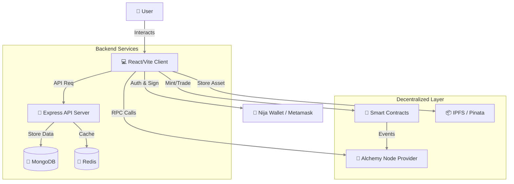
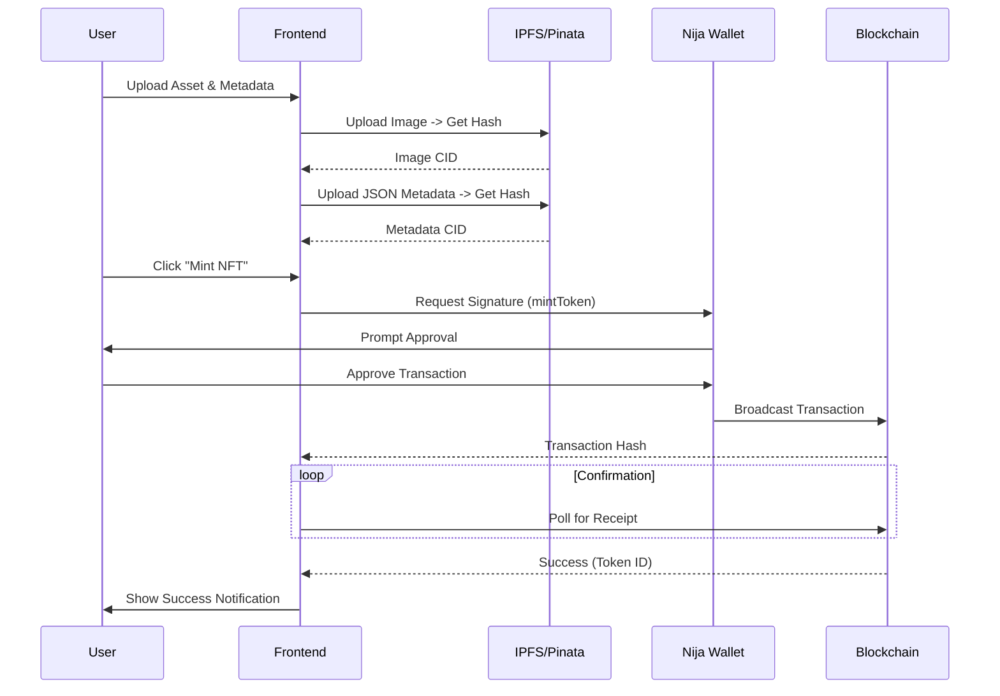
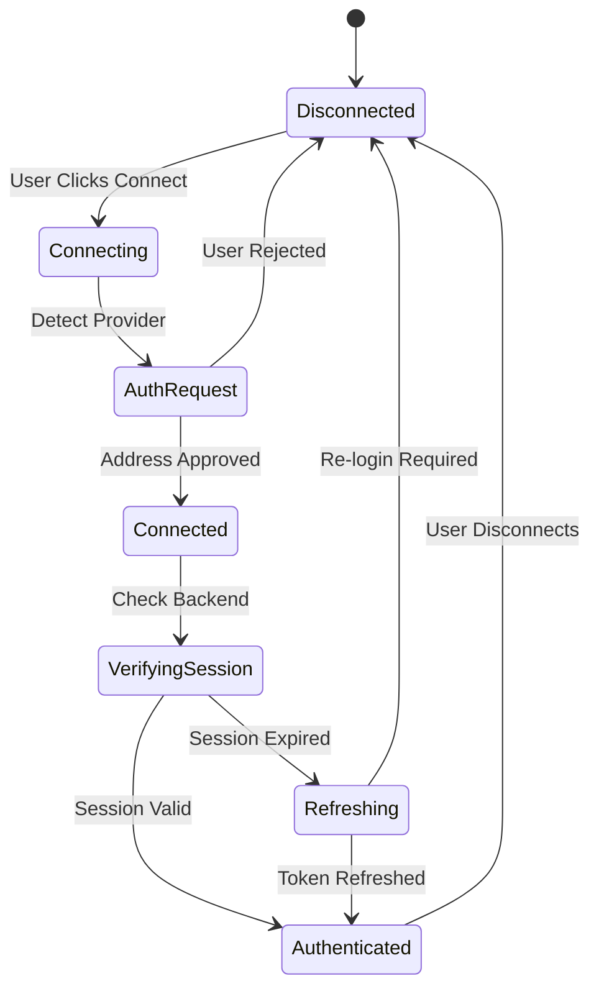

# 🎨 NFTGen - Next Gen NFT Platform
> **Advanced NFT Minting, Trading & Portfolio Management System**


<div align="center">

[](https://reactjs.org/)
[](https://www.typescriptlang.org/)
[](https://vitejs.dev/)
[](https://ethereum.org/)
[](https://ipfs.tech/)
[](https://tailwindcss.com/)

[Request Demo](https://nftgen.platform/demo) · [Report Bug](https://github.com/MrDecryptDecipher/NFTGen/issues) · [Request Feature](https://github.com/MrDecryptDecipher/NFTGen/issues)

</div>

---

## 📖 Introduction

**NFTGen** is a cutting-edge, decentralized application (DApp) designed to bridging the gap between traditional finance and the NFT ecosystem. It offers a robust, user-friendly interface for **minting**, **trading**, and **analyzing** Non-Fungible Tokens across multiple blockchains.

Built with performance and scalability in mind, NFTGen leverages **Alchemy's** powerful infrastructure for real-time blockchain data, **IPFS** for decentralized storage, and integrates seamlessly with **Nija Wallet** for secure transaction signing.

## 🚀 Key Features

### 🎨 Advanced Minting Studio
- **Drag & Drop Creation**: intuitive interface for uploading artwork.
- **IPFS Integration**: Automatic decentralized storage for metadata and assets.
- **Multi-Chain Support**: Mint on Ethereum Mainnet, Sepolia, and compatible EVM chains.
- **Fractionalization**: (Beta) Create fractionalized ownership of high-value assets.

### 💼 Portfolio Management
- **Real-Time Valuation**: Track the value of your NFT holdings with live floor prices.
- **Historical AnaLysis**: View transaction history and price trends.
- **Gallery View**: immersive 3D-ready gallery to showcase collections.

### 🔐 Secure Wallet Integration
- **Nija Wallet Native**: Optimized for Nija Wallet with specialized authentication flows.
- **Multi-Wallet Support**: Compatible with MetaMask, WalletConnect, and Coinbase Wallet.
- **Session Management**: Persistent, secure sessions for uninterrupted trading.

---

## 🏗 System Architecture

NFTGen follows a modern, component-based architecture designed for high availability and low latency.

### High-Level Overview



### NFT Minting Flow

The minting process is streamlined to ensure atomicity and reliability.



### Wallet Authentication State Logic

Seamless session management to handle multiple wallet states.



---

## 🛠 Tech Stack

| Layer | Technology | Description |
|-------|------------|-------------|
| **Frontend** | React 18, Vite | High-performance UI library and build tool. |
| **Styling** | Tailwind CSS | Utility-first CSS framework for rapid design. |
| **Language** | TypeScript | Type-safe JavaScript for robust development. |
| **Blockchain** | Ethers.js, Wagmi | Libraries for Ethereum interaction. |
| **Storage** | NFT.Storage, Pinata | Decentralized storage solutions for NFT assets. |
| **Backend** | Express, Node.js | API layer for off-chain data and caching. |
| **Contracts** | Solidity, Hardhat | Smart contract development and testing framework. |

---

## 🏁 Getting Started

### Prerequisites
- Node.js v16+
- NPM or PNPM
- A Web3 Wallet (Metamask or Nija Wallet)

### Installation

1. **Clone the repository**
   ```bash
   git clone https://github.com/MrDecryptDecipher/NFTGen.git
   cd NFTGen
   ```

2. **Install Dependencies**
   ```bash
   npm install
   ```

3. **Configure Environment**
   Create a `.env` file in the root directory:
   ```env
   VITE_ALCHEMY_API_KEY=your_alchemy_key
   VITE_WALLETCONNECT_PROJECT_ID=your_project_id
   VITE_API_URL=http://localhost:3000
   ```

4. **Run Development Server**
   ```bash
   npm run dev
   ```

5. **Deploy Contracts (Optional)**
   ```bash
   npx hardhat run scripts/deploy.js --network sepolia
   ```

---

## 🔮 Roadmap

- [x] Core Minting Engine
- [x] Wallet Integration (Nija/Metamask)
- [x] Gallery View
- [ ] Marketplace Trading Logic
- [ ] Cross-chain Bridging
- [ ] Mobile App (React Native)

---

## 🤝 Contributing

We welcome contributions! Please see our [Contributing Guidelines](CONTRIBUTING.md) for details.

1. Fork the Project
2. Create your Feature Branch (`git checkout -b feature/AmazingFeature`)
3. Commit your Changes (`git commit -m 'Add some AmazingFeature'`)
4. Push to the Branch (`git push origin feature/AmazingFeature`)
5. Open a Pull Request

---

## 📄 License

Distributed under the MIT License. See `LICENSE` for more information.

---

<div align="center">
  <p>Maintained by <a href="https://github.com/MrDecryptDecipher">MrDecryptDecipher</a></p>
  <p>
    <a href="mailto:sandeep.savethem2@gmail.com">Contact Support</a>
  </p>
</div>