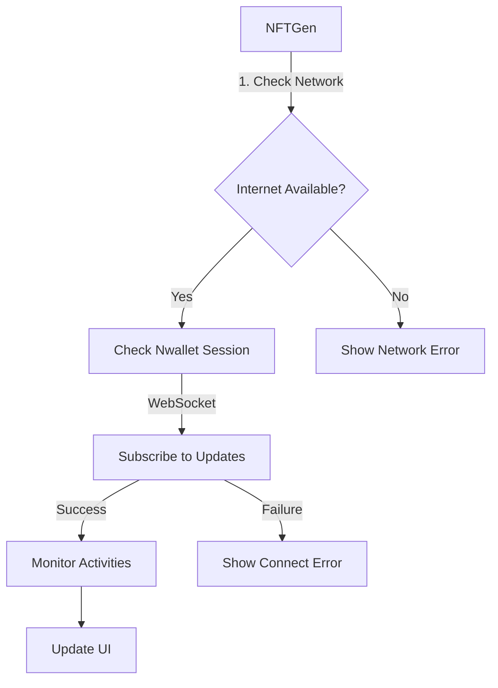

# NFTGen Integration with Nija Wallet (Nwallet)

## Overview
NFTGen is designed to work seamlessly with Nwallet, a web-based crypto wallet. This document outlines the integration approach and key concepts.

## Core Architecture

### 1. Direct Web Integration
- Nwallet runs as a web service at `http://13.126.230.108:5174`
- WebSocket server runs at port 5176 for real-time updates
- NFTGen communicates with Nwallet via HTTP APIs and WebSocket
- Uses shared activity tracking for NFT transactions

### 2. Connection Flow


### 3. Key Components

#### a. Activity Management
```typescript
// Monitor NFT activities
const activities = await fetch('http://13.126.230.108:5174/api/activities');
if (activities.ok) {
  const data = await activities.json();
  // Handle NFT activities
}
```

#### b. WebSocket Connection
```typescript
// Connect to WebSocket for real-time updates
const ws = new WebSocket('ws://13.126.230.108:5176');
ws.onmessage = (event) => {
  const data = JSON.parse(event.data);
  // Handle real-time updates
};
```

#### c. Error Handling
- Network connectivity checks
- WebSocket reconnection logic
- Clear error messages for users
- Activity verification handling

## API Endpoints

### 1. Core Endpoints
- `/api/activities` - Get all NFT activities
- `/api/activities/:hash` - Get specific activity
- `/api/verify` - Verify NFT transaction
- `/health` - Service health check

### 2. Activity Format
```typescript
interface Activity {
  hash: string;
  createdAt: number;
  updatedAt?: number;
  // Additional NFT-specific data
}
```

## Best Practices

### 1. Activity Management
- Regular polling of activities endpoint
- WebSocket subscription for real-time updates
- Local caching of activity data
- Proper error handling and retries

### 2. User Experience
- Show real-time NFT transaction status
- Clear activity history display
- Transaction verification status
- Helpful error messages

### 3. Security
- Verify transaction hashes
- Validate activity data
- Handle WebSocket disconnects
- Regular health checks

## Implementation Example

### 1. Activity Monitoring
```typescript
// Set up activity monitoring
async function monitorActivities() {
  try {
    const response = await fetch('http://13.126.230.108:5174/api/activities');
    if (response.ok) {
      const activities = await response.json();
      updateActivityDisplay(activities);
    }
  } catch (error) {
    console.error('Error monitoring activities:', error);
  }
}
```

### 2. WebSocket Setup
```typescript
function setupWebSocket() {
  const ws = new WebSocket('ws://13.126.230.108:5176');
  
  ws.onopen = () => {
    console.log('Connected to Nwallet WebSocket');
  };
  
  ws.onmessage = (event) => {
    const update = JSON.parse(event.data);
    handleActivityUpdate(update);
  };
  
  ws.onclose = () => {
    setTimeout(setupWebSocket, 5000); // Reconnect after 5 seconds
  };
}
```

### 3. Transaction Verification
```typescript
async function verifyTransaction(hash: string) {
  try {
    const response = await fetch('http://13.126.230.108:5174/api/verify', {
      method: 'POST',
      headers: { 'Content-Type': 'application/json' },
      body: JSON.stringify({ hash })
    });
    
    if (response.ok) {
      const result = await response.json();
      updateVerificationStatus(result);
    }
  } catch (error) {
    console.error('Error verifying transaction:', error);
  }
}
```

## Required Changes in Nwallet

### 1. CORS Configuration
```javascript
app.use(cors({
  origin: 'http://13.126.230.108:5175', // NFTGen URL
  methods: ['GET', 'POST'],
  allowedHeaders: ['Content-Type']
}));
```

### 2. WebSocket Events
- `nft_minted` - New NFT minted
- `nft_transferred` - NFT transferred
- `transaction_verified` - Transaction verification complete

### 3. Activity Storage
- Persistent storage for NFT activities
- Regular cleanup of old activities
- Activity indexing for quick retrieval

## Common Issues and Solutions

### 1. Connection Issues
- Check WebSocket connection
- Verify network connectivity
- Monitor activity endpoint health
- Handle reconnection gracefully

### 2. Data Synchronization
- Regular activity polling
- WebSocket event handling
- Local state management
- Conflict resolution

### 3. Error Handling
- Network errors: Automatic retry
- WebSocket errors: Reconnection
- API errors: Clear messages
- Data validation errors: User feedback

## Testing

### 1. Integration Tests
- Activity endpoint connectivity
- WebSocket communication
- Transaction verification
- Error handling scenarios

### 2. Performance Tests
- Activity polling performance
- WebSocket message handling
- Concurrent transaction verification
- Large activity set handling

## Future Improvements

### 1. Performance Enhancements
- Activity data pagination
- WebSocket message batching
- Improved caching strategies
- Optimized polling intervals

### 2. Feature Additions
- Activity filtering and search
- Enhanced verification methods
- Better error recovery
- Advanced monitoring

## Notes
- Keep implementation focused on NFT activities
- Maintain WebSocket connection
- Regular health checks
- Clear error handling
- Activity data validation
- Performance optimization 